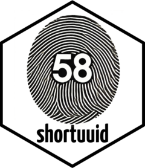

<!-- README.md is generated from README.Rmd. Please edit that file -->

# shortuuid 

<!-- badges: start -->

[](https://github.com/schochastics/shortuuid/actions/workflows/R-CMD-check.yaml)
[](https://CRAN.R-project.org/package=shortuuid)
<!-- badges: end -->

The goal of shortuuid is to generate and translate standard UUIDs into
shorter - or just different - formats and back. Inspired by
[short-uuid](https://www.npmjs.com/package/short-uuid) and a post on
[fosstodon](https://fosstodon.org/@josi/112978240064605859)

## Installation

You can install the development version of shortuuid like so:

``` r
pak::pak("schochastics/shortuuid")
```

## Example

This package provides functions to generate and convert UUIDs to
different formats.

``` r
library(shortuuid)
# generate random uuids
ids <- generate_uuid(n = 5)
ids
#> [1] "1fc2d238-b6f2-4959-af5a-ef9950a4141a"
#> [2] "fa49a3f8-1644-4e8b-879c-a68d6292e4e1"
#> [3] "c4109bd3-4d8a-489c-a77a-3a6877ebaab8"
#> [4] "a4f70fce-0469-4044-aa4b-4fdb8ec57281"
#> [5] "e8d5f85c-897e-4911-b2f6-d29f816c6643"
is.uuid(ids)
#> [1] TRUE TRUE TRUE TRUE TRUE

# alphabet: "123456789ABCDEFGHJKLMNPQRSTUVWXYZabcdefghijkmnopqrstuvwxyz"
b58 <- uuid_to_bitcoin58(ids)
b58
#> [1] "4vUZZwaGqmgoLNPrhaZ7JR" "Xuam1xXi4St4kqawLF7mTW" "RDEZPCTUM76cnx3yioKHAX"
#> [4] "MNVfwXsPf2tqwEdFWqqg9N" "VkbFLW53t7FfTRUgVuxMg6"

# alphabet: "123456789abcdefghijkmnopqrstuvwxyzABCDEFGHJKLMNPQRSTUVWXYZ"
f58 <- uuid_to_flickr58(ids)
f58
#> [1] "4VtyyWzgQLFNknoRGzy7iq" "wUzL1XwH4rT4KQzWkf7Lsv" "qdeyocstm76BMX3YHNjhaw"
#> [4] "mnuEWwSoE2TQWeCfvQQF9n" "uKAfkv53T7fEsqtFuUXmF6"
# convert back
bitcoin58_to_uuid(b58)
#> [1] "1fc2d238-b6f2-4959-af5a-ef9950a4141a"
#> [2] "fa49a3f8-1644-4e8b-879c-a68d6292e4e1"
#> [3] "c4109bd3-4d8a-489c-a77a-3a6877ebaab8"
#> [4] "a4f70fce-0469-4044-aa4b-4fdb8ec57281"
#> [5] "e8d5f85c-897e-4911-b2f6-d29f816c6643"
flickr58_to_uuid(f58)
#> [1] "1fc2d238-b6f2-4959-af5a-ef9950a4141a"
#> [2] "fa49a3f8-1644-4e8b-879c-a68d6292e4e1"
#> [3] "c4109bd3-4d8a-489c-a77a-3a6877ebaab8"
#> [4] "a4f70fce-0469-4044-aa4b-4fdb8ec57281"
#> [5] "e8d5f85c-897e-4911-b2f6-d29f816c6643"
```

## Addendum

Code to generate uuids taken from
[@rkg8](https://github.com/rkg82/uuid-v4)
